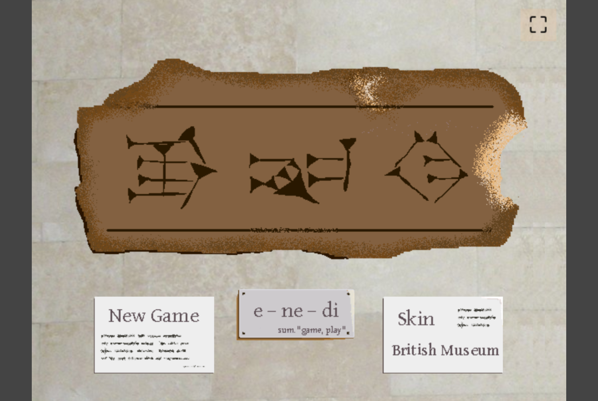

# Enedi
A recreation of the ancient [Game of Ur](https://en.wikipedia.org/wiki/Royal_Game_of_Ur).

> Check out the live version at https://lenzls.github.io/enedi/
(Works best in chrome)

The game can either be played in hot seat multiplayer or against the computer (you can even watch computer vs. computer).

------

There are two different skins to choose from:

1) British Museum

Strives to look like the original board, currently held in [the collection of the british museum in london](https://www.britishmuseum.org/collection/object/W_1928-1009-378), dug out by Sir Leonard Woolley in 1928 at the site of Ur located in modern day Iraq and originally created by an unknown sumerian artist roughly 4500 years ago!

Sadly in the current version this skin is a tad confusing, hence the creation of 

2) Simple

Just shows you the necessities without any artistic value.

